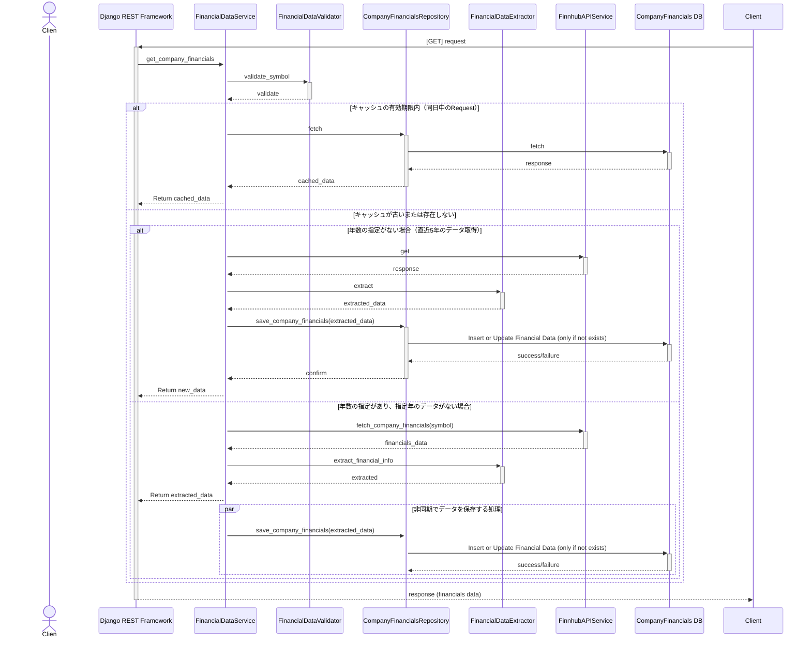
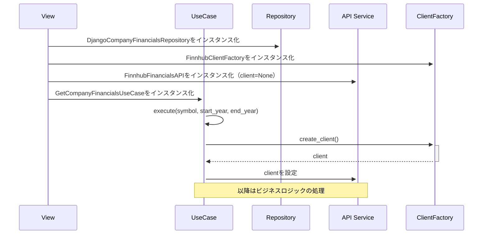

# 1.Directory Structure

```
company_financials
├── __init__.py
├── admin.py
├── apps.py
├── models.py                                         # database model
├── views.py                                          # view
├── core/
│   ├── domain/                                       # domain
│   │   ├── company_symbol_validator.py
│   │   ├── financial_data_extractor.py
│   │   └── company_financials_domain_service.py
│   ├── repository/                                   # interface
│   │   └── company_financials_repository.py
│   └── use_case/                                     # use case
│       └── get_company_financials_use_case.py
├── infra/
│   ├── external/                                     # Correct Factory, API by infra
│   │   ├── finnhub_client_factory.py
│   │   └── finnhub_financials_api.py
│   └── repository/                                   # repository
│       └── django_company_financials_repository.py
├── web/
│   └── serializers/
│       └── company_financials_serializer.py          # interface for serializer
└── migrations/                  
```

# 2.Domain Models
プロジェクトで使用されるドメインモデルについて

## 1.1 Entity
CompanyFinancials モデルは、企業の財務データを表すエンティティ<br>
企業のシンボル、財務データの年度、財務データの種類、財務データの値を保持する<br>
models.py
```from django.db import models
class CompanyFinancials(models.Model):
    ticker = models.CharField(max_length=10)
    fiscal_year = models.IntegerField()
    total_revenue = models.FloatField(null=True, blank=True)
    normalized_ebitda = models.FloatField(null=True, blank=True)
    stockholders_equity = models.FloatField(null=True, blank=True)
    free_cash_flow = models.FloatField(null=True, blank=True)
    capital_expenditures = models.FloatField(null=True, blank=True)
    total_assets = models.FloatField(null=True, blank=True)
    total_liabilities = models.FloatField(null=True, blank=True)
    gross_profit = models.FloatField(null=True, blank=True)
    net_income_loss = models.FloatField(null=True, blank=True)
    operating_expenses = models.FloatField(null=True, blank=True)
    created_at = models.DateTimeField(auto_now_add=True)
```


## 1.2 Repository
### repository/
core/repository/company_financials_repository.py<br>
財務データの保存と取得のためのリポジトリの抽象クラス（インターフェース）
企業の財務データを保存・取得するためのインターフェースを定義

## 1.3 Domain
ビジネスロジックやドメインに関する処理を担当
#### 1.3.1. CompanySymbolValidator
core/domain/company_symbol_validator.py<br>
企業のシンボルをバリデーション

#### 1.3.2. FinancialDataExtractor
core/domain/financial_data_extractor.py<br>
外部APIの生データから財務データを抽出・変換

#### 1.3.3. CompanyFinancialsDomainService
core/domain/company_financials_domain_service.py<br>
財務データの処理を統括

## 1.4 Use Case
#### 1.4.1. GetCompanyFinancialsUseCase
core/use_case/get_company_financials_use_case.py<br>
ユースケースを定義するクラスで、ユーザーからのリクエストに応じて適切なサービスを呼び出す

## 1.5 Infra
### 1.5.1. FinnhubClientFactory
infra/external/finnhub_client_factory.py<br>
Finnhub APIのクライアントのインスタンスを作成するファクトリ

### 1.5.2. FinnhubFinancialsAPI
infra/external/finnhub_financials_api.py<br>
Finnhub APIを使用して企業の財務データを取得する

## 1.6 Web
### 1.6.1 CompanyFinancialsSerializer
web/serializers/company_financials_serializer.py<br>
CompanyFinancialsモデルのデータをシリアライズする

# 3.Sequence Diagrams

## REST API

### company_financials
### GET


### Sequence Diagram


### Dependency Injection Sequence
