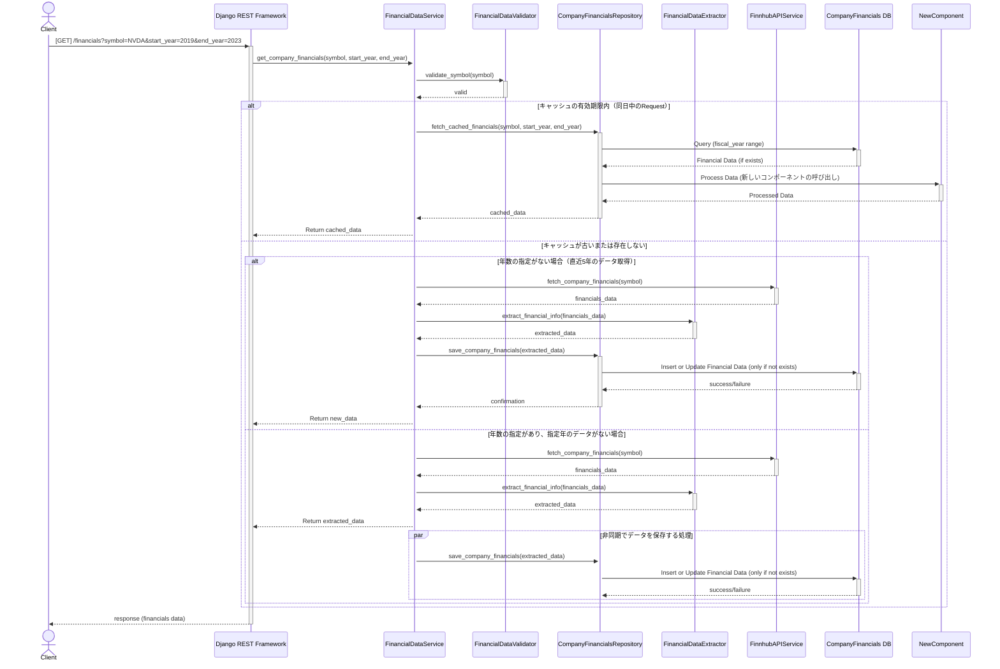

# Sequence Diagrams

## REST API

### company_financials
### GET

```mermaid
sequenceDiagram
    actor Client
    participant Django as Django REST Framework
    participant Service as FinancialDataService
    participant Validator as FinancialDataValidator
    participant Repo as CompanyFinancialsRepository
    participant Extractor as FinancialDataExtractor
    participant FinnhubAPI as FinnhubAPIService
    participant DB as CompanyFinancials DB

    Client ->>+ Django: [GET] /financials?symbol=NVDA&start_year=2019&end_year=2023
    Django ->>+ Service: get_company_financials(symbol, start_year, end_year)
    
    Service ->>+ Validator: validate_symbol(symbol)
    Validator -->>- Service: valid

    alt キャッシュの有効期限内（同日中のRequest）
        Service ->>+ Repo: fetch_cached_financials(symbol, start_year, end_year)
        Repo ->>+ DB: Query (fiscal_year range)
        DB -->>- Repo: Financial Data (if exists)
        
        Repo ->>+ NewComponent: Process Data (新しいコンポーネントの呼び出し)
        NewComponent -->>- Repo: Processed Data
        
        Repo -->>- Service: cached_data
        Service -->> Django: Return cached_data
    else キャッシュが古いまたは存在しない
        alt 年数の指定がない場合（直近5年のデータ取得）
            Service ->>+ FinnhubAPI: fetch_company_financials(symbol)
            FinnhubAPI -->>- Service: financials_data
            
            Service ->>+ Extractor: extract_financial_info(financials_data)
            Extractor -->>- Service: extracted_data
            
            Service ->>+ Repo: save_company_financials(extracted_data)
            Repo ->>+ DB: Insert or Update Financial Data (only if not exists)
            DB -->>- Repo: success/failure
            Repo -->>- Service: confirmation
            
            Service -->> Django: Return new_data
        else 年数の指定があり、指定年のデータがない場合
            Service ->>+ FinnhubAPI: fetch_company_financials(symbol)
            FinnhubAPI -->>- Service: financials_data
            
            Service ->>+ Extractor: extract_financial_info(financials_data)
            Extractor -->>- Service: extracted_data
            
            Service -->> Django: Return extracted_data
            
            par 非同期でデータを保存する処理
                Service ->>+ Repo: save_company_financials(extracted_data)
                Repo ->>+ DB: Insert or Update Financial Data (only if not exists)
                DB -->>- Repo: success/failure
            end
        end
    end

    Django -->>- Client: response (financials data)
```