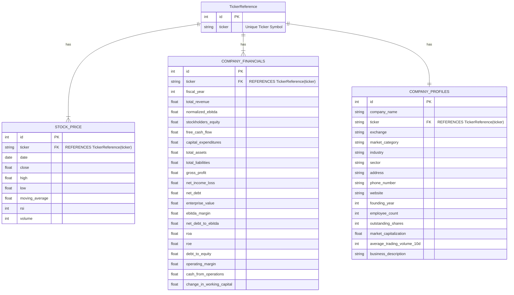

```mermaid
erDiagram
    TickerReference {
        int id PK
        string ticker "Unique Ticker Symbol"
    }

    STOCK_PRICE {
        int id PK
        string ticker FK "REFERENCES TickerReference(ticker)"
        date date
        float close
        float high
        float low
        float moving_average
        int rsi
        int volume
    }

    COMPANY_FINANCIALS {
        int id PK
        string ticker FK "REFERENCES TickerReference(ticker)"
        int fiscal_year
        float total_revenue
        float normalized_ebitda
        float stockholders_equity
        float free_cash_flow
        float capital_expenditures
        float total_assets
        
        float total_liabilities
        float gross_profit
        float net_income_loss
        float net_debt
        float enterprise_value
        float ebitda_margin
        float net_debt_to_ebitda
        float roa
        float roe
        float debt_to_equity
        float operating_margin
        float cash_from_operations
        float change_in_working_capital
    }

    COMPANY_PROFILES {
        int id PK
        string company_name
        string ticker FK "REFERENCES TickerReference(ticker)"
        string exchange
        string market_category
        string industry
        string sector
        string address
        string phone_number
        string website
        int founding_year
        int employee_count
        int outstanding_shares
        float market_capitalization
        int average_trading_volume_10d
        string business_description
    }

    %% リレーションの定義
    TickerReference ||--|{ STOCK_PRICE: "has"
    TickerReference ||--|{ COMPANY_FINANCIALS: "has"
    TickerReference ||--|| COMPANY_PROFILES: "has"
```